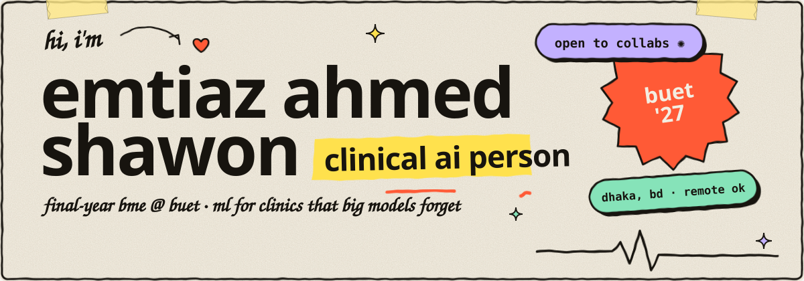

<a href="https://www.linkedin.com/in/emtiazahmed-shawon-414842317">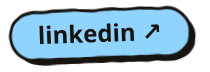</a>
<a href="https://www.kaggle.com/emtiazahmedshawon">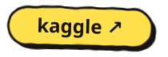</a>
<a href="https://github.com/Emtiaz-10?tab=repositories">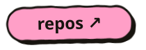</a>

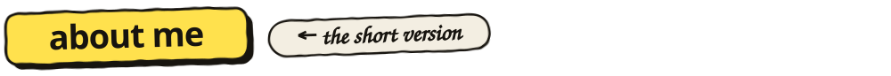

hey, i'm emtiaz. final-year biomedical engineering at **BUET** in dhaka, currently open to remote work and research collabs.

i build ml for the places big models tend to forget: rural clinics, thin bandwidth, small datasets. most of my actual work is checking whether the model works or the dataset is just leaking the answer. (in my thesis it was leaking. i fixed it and reported the null result anyway.)

i work in **clinical ai, medical imaging, biosignals and equitable health tech**. i speak bengali, english, hindi, and a little urdu.

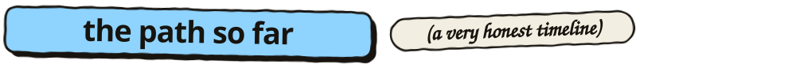

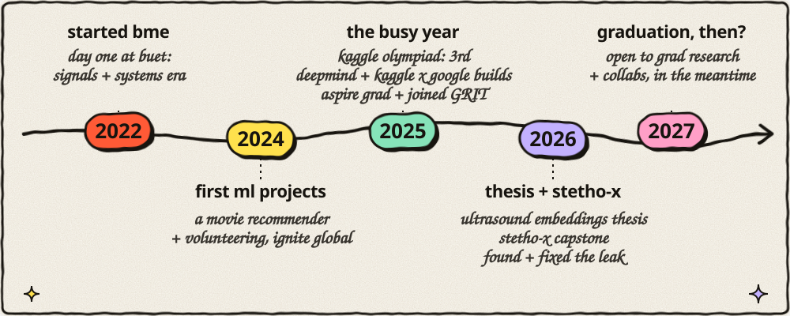

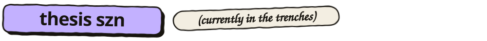

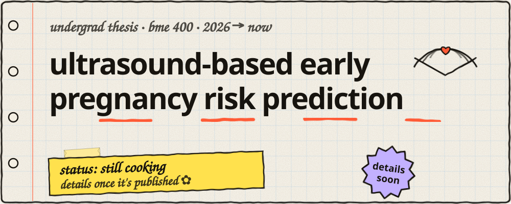

code and data stay private (patient data). methods and findings get shared once they're cleared.

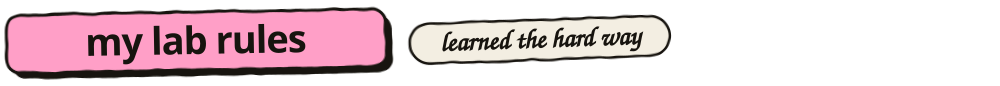

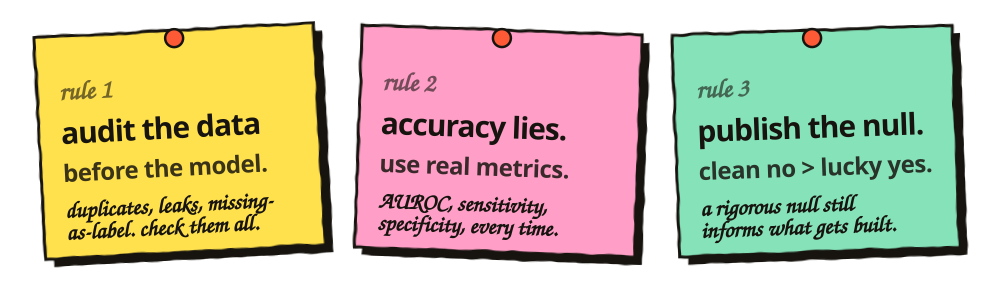

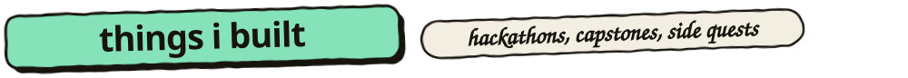

<a href="https://github.com/Emtiaz-10?tab=repositories">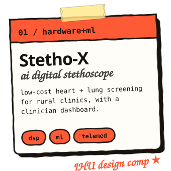</a>
<a href="https://www.kaggle.com/competitions/gemini-3/writeups/medi-pal-gemini-submission">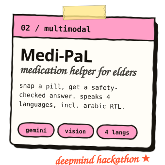</a>
<a href="https://www.kaggle.com/competitions/agents-intensive-capstone-project/writeups/new-writeup-1764529856285">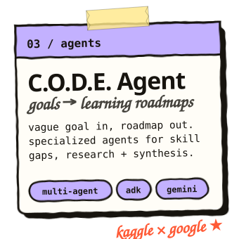</a>

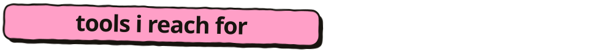

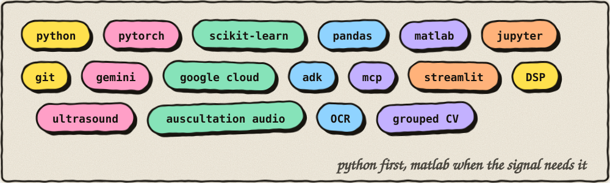

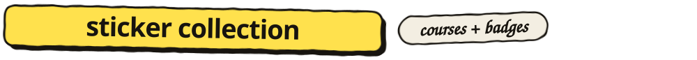

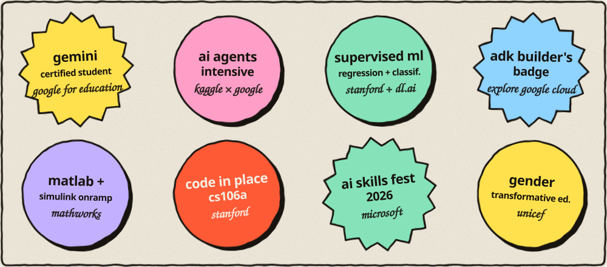

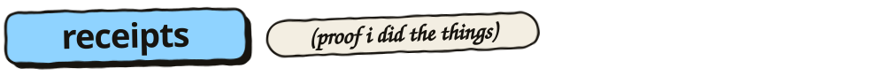

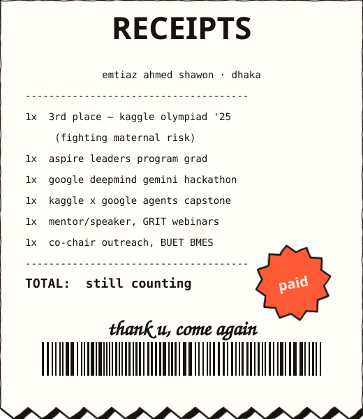

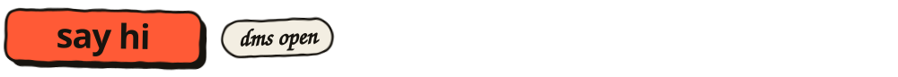

working on clinical ai, medical imaging, or health tech for low-resource settings? i'd like to hear about it. the fastest way to reach me is [linkedin](https://www.linkedin.com/in/emtiazahmed-shawon-414842317).

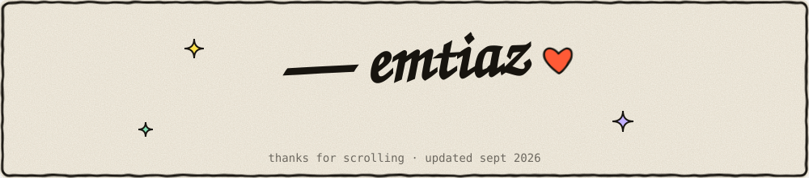
